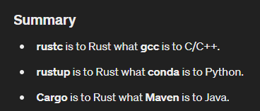

# IMPORTANT: RESOURCES

Rust Crash Course with Modules: 
https://github.com/coderaidershaun/rust_course_playaround.git

Actix Web Server Template: 
https://github.com/coderaidershaun/rust-web-server-template.git

Auto-Gippity Full Code Download:
https://github.com/coderaidershaun/rust-auto-gippity-full-code.git

Project Marvin:
https://github.com/PrefectHQ/marvin

Project AutoGPT:
https://github.com/Significant-Gravitas/Auto-GPT

---
# Resource: 
https://rust-lang.github.io/rustup/index.html

Show current version
`rustup --version `

Update rust
`rustup update`

List toolchains
`rustup toolchain list`

Install specific version
`rustup toolchain install <version>`

Set default version
`rustup default <version>`

Uninstall a toolchain
`rustup toolchain uninstall <version>`

Add target for cross-compilation
`rustup target add <target>`

List installed components
`rustup component list`

Add a component
`rustup component add <component>`

Remove a component
`rustup component remove <component>`

Check which rustc binary is currently in use
`rustup which rustc`

---
# Cargo Notes

To create a new project
`cargo new <project_name>`

To add a dependency
`cargo add <dependency>`

To add a dependency with all features
`cargo add <dependency> --features full`

To build a project
`cargo build`

To run a project
`cargo run`

To build a project for release
`cargo build --release`